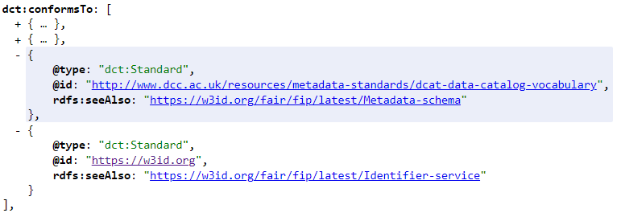
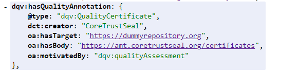
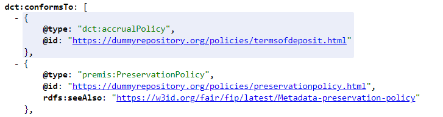
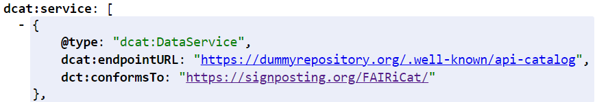

1. ### ***Exposing Repository Information with DCAT***

We follow the definition of data repository given by DCAT-AP[^1] *“a catalogue or repository that hosts the Datasets or Data Services being described.”* and therefore model a repository as an instance of dcat:Catalog. To indicate the operational and organisational nature of a data repository we recommend to additionally use foaf:Project and/or foaf:Organisation for each instance of a data repository.

1. #### Descriptive Metadata

To provide basic descriptive metadata corresponding to DRAWG properties the use of DCAT properties as well as Dublin Core terms[^2] is recommended. In addition, friend of a friend (foaf) properties[^3] can be used in case catalogue instances are modelled as foaf:Project or foaf:Organization. 

Most of these properties will be provided as Literals. However, we follow the recommendation of DCAT-AP to use instances of foaf:Agent (here foaf:Organization) for dct:publisher values. In addition, vcard:Organization[^4] should be used as type for dct:publisher. This allows to include address information such as country name, which is required to provide DRAWG’s ‘Country’ property info. 

**Table 2 \- Mapping of different DRAWG attributes to recommended properties.**

| DRAWG | DCAT |
| :---- | :---- |
| Repository Name | dct:title (foaf:name) |
| URL | dct:identifier (foaf:homepage) |
| Description | dct:description |
| Language | dct:language |
| Research Area | dcat:theme or dct:subject |
| Organisation | dct:publisher (a foaf:Organization, vcard:Organization) |
| Country | dct:publisher (a vcard:Organization) \=\> vcard:country-name |
| Dataset Use License | dct:license |
| Terms of Access | dct:accessRights |
| Contact | dcat:contactPoint |

2. #### Supported Standards

To expose information about standards offered to support machine interoperability, we recommend using dcat:service which allows us to provide a list of instances of dcat:DataService. There, the properties dcat:endpointURL and dct:conformsTo shall be used to provide information about the service endpoint URL as well as the service type which should be the web link to the documentation of the standard the web API follows (see the Appendix  and the living document[^5]).

**Figure 3 \- Example of dcat:service use**

Supported standards which do not represent actionable services can be expressed using the   
dct:conformsTo property which shall point to an instance of dct:Standard. The property rdfs:seeAlso may be used to additionally indicate which standard type is listed. Here we recommend to use the FAIR Implementation Profile (FIP) vocabulary[^6].

To unambiguously identify a metadata standard we recommend to use a linked term from either the DCC metadata list[^7] or from FAIRsharing[^8]. In case a XML standard is used the namespace identifier can also be used.

To indicate supported persistent identifier (PID) types, we recommend using the home URI of a PID system (e.g. DOI[^9], Handle[^10], etc.), which uniquely identifies a PID system.

  
**Figure 4 \- Example of persistent identifier type exposure**

3. #### Policies and Principles

Similar to the way we recommend to indicate standards, the dct:conformsTo property should be used to link an instance of dct:Policy or subclasses of dct:Policy. Here we recommend to use dct:accrualPolicy to indicate documents which describe the terms of deposit and the premis:PreservationPolicy[^11] to indicate the preservation and/or curation policy of a data repository.

**Table 3 \- Mapping of dct:conformsTo to other properties for different DRAWG attributes.**

| DRAWG | DCAT |
| :---- | :---- |
| Curation | dct:conformsTo \=\> dct:Policy or premis:PreservationPolicy |
| Terms of Deposit | dct:conformsTo \=\> dct:accrualPolicy |
| Preservation | dct:conformsTo \=\> premis:PreservationPolicy |

  
**Figure 5 \- Example of policy exposure**

4. #### Certification and Quality Information

The Data Quality Vocabulary (DQV) is part of the W3C data on the web best practices family of standards and recommended to be used within DCAT to indicate quality assessments and certificates. Therefore, we recommend to use the dqv:hasQualityAnnotation to indicate an instance of dqv:QualityCertificate, which links e.g. a CoreTrustSeal certificate of a data repository. The issuer of such a certificate can be indicated using the dc:creator property. The certificate itself has to be contained via a oa:hasBody[^12] property since a dqv:QualityCertificate is a subclass of oa:Annotation.  There, we recommend to use the DOI of a CoreTrustSeal certificate which is not shown in the example below (Figure 6).

**Table 4 \- Mapping of DRAWG attribute to properties.**

| DRAWG | DCAT |
| :---- | :---- |
| Certification | dqv:hasQualityAnnotation \=\> dqv:QualityCertificate |

 
**Figure 6 \- Example of certificate exposure**

[^1]:  [https://semiceu.github.io/DCAT-AP/releases/3.0.0/\#Catalogue](https://semiceu.github.io/DCAT-AP/releases/3.0.0/#Catalogue) 

[^2]:  [https://www.dublincore.org/specifications/dublin-core/dcmi-terms/](https://www.dublincore.org/specifications/dublin-core/dcmi-terms/) 

[^3]:  [http://xmlns.com/foaf/spec/](http://xmlns.com/foaf/spec/) 

[^4]:  [https://www.w3.org/TR/vcard-rdf/](https://www.w3.org/TR/vcard-rdf/) 

[^5]:  [https://docs.google.com/spreadsheets/d/1mfVK5kEqTCi67R-6bmDj4-qfvi2pPHdLFnL-hqvZqEE/edit?gid=0\#gid=0](https://docs.google.com/spreadsheets/d/1mfVK5kEqTCi67R-6bmDj4-qfvi2pPHdLFnL-hqvZqEE/edit?gid=0#gid=0) 

[^6]:  [https://w3id.org/fair/fip/](https://w3id.org/fair/fip/) 

[^7]:  [http://www.dcc.ac.uk/resources/metadata-standards](http://www.dcc.ac.uk/resources/metadata-standards) 

[^8]:  [https://fairsharing.org](https://fairsharing.org) 

[^9]:  [https://doi.org](https://doi.org) 

[^10]:  [https://handle.net](https://handle.net) 

[^11]:  [https://www.loc.gov/standards/premis/](https://www.loc.gov/standards/premis/) 

[^12]:  [https://www.w3.org/community/openannotation/](https://www.w3.org/community/openannotation/) 
